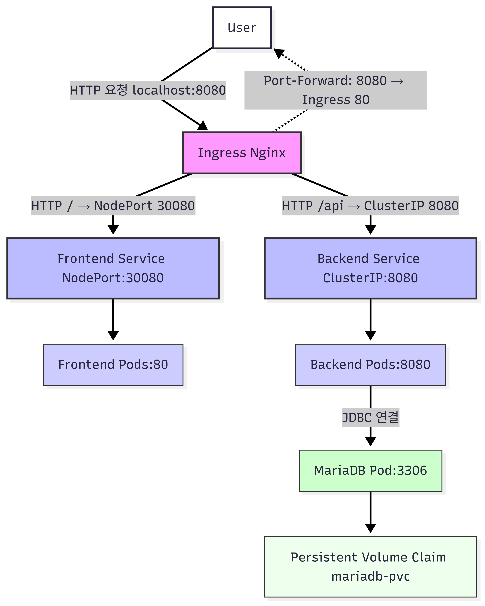

# StatusBoard Infrastructure

## Overview
StatusBoard 프로젝트의 Kubernetes 기반 인프라를 관리하는 레포입니다.  

- **Frontend**: Vue + Nginx (NodePort)  
- **Backend**: Spring Boot (ClusterIP)  
- **Database**: MariaDB + PVC  
- **Ingress Nginx**: HTTP `/api` → backend, `/` → frontend  
- **Port-Forward**: 로컬 개발용 지원



## Components
- **Frontend Service**: NodePort, 30080, Vue 앱 배포  
- **Backend Service**: ClusterIP, 8080, Spring Boot  
- **Database**: MariaDB, PVC 연결  
- **Ingress Nginx**: /api → backend, / → frontend, Regex 지원  
- **Port-Forward**: 로컬 개발용, ingress 80 → 8080

## Deployment

```bash
# 전체 배포
kubectl apply -f k8s/all-in-one.yaml

# Port-Forward (로컬 개발용)
kubectl port-forward -n ingress-nginx svc/ingress-nginx-controller 8080:80


##Testing
- **Frontend**: http://localhost:8080

- **Backend API**: http://localhost:8080/api/monitor
